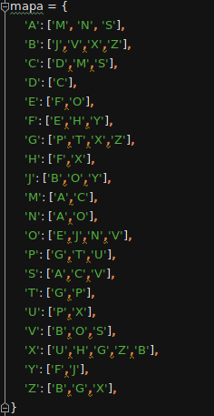

# BÚSQUEDAS EN AMPLITUD

# Introducción
Para dar pie al tema, iniciemos definiendo qué son las "Búsquedas". 
Las búsquedas, son una técnica para resolver problemas, en donde se examinan las posibles secuencias que conduzcan a valores conocidos y así, poder elegir la mejor de estas.

Alguna vez en nuestra vida hemos estado frente a la interrogante: "¿Qué camino debo elegir para llegar a cierto lugar?"
Este proyecto trata de resolver dicha interrogante mediante la implementación de **_búsquedas de amplitud_**, con el propósito de determinar cual ruta se debe seguir para ir de un punto inicial hasta llegar a nuestro destino.  Este tipo de algoritmo es de particular importancia en varios problemas de decisión, donde lo que se requiere es encontrar una solución o probar que no existe ninguna solución.

# Metodología
La búsqueda en amplitud es un recorrido de grafo (usado frecuentemente en árboles) en donde se toma el nodo raíz, después sus sucesores, expandiendo todos los nodos a una profundidas en el árbol de búsqueda antes de expandir cualquier nodo del próximo nivel, en este tipo de busqueda la estructura de datos empleada es **Fifo** es decir primero en entrar-primero en salir. 

En este caso supongamos que nos encontramos en la ciudad de Xalapa, y queremos llegar a San Andrés Tuxtla, apoyados del siguiente mapa:

Lo que hará nuestro programa es determinar el nodo raíz, en este caso es _Xalapa_, seguido de expandir los sucesores del nodo raíz (vecinos de _Xalapa_), los cuales son: _Teziutlán_, _Huatusco_, _Vega de Alatorre_, _Zempoala_ y _Boca del Río_, como ninguna ciudad es el destino volvemos a expandir nuestros nodos, comenzando por los vecinos de _Boca del Río_, sin repetir los nodos ya analizados. Los vecinos de _Boca del Río_ son _Joachín_ y  _Alvarado_, nuevamente ninguno de los anteriores es el destino, al igual que los vecinos de las ciudades de _Teziutlán_, _Huatusco_, _Vega de Alatorre_ y _Zempoala_ , por ende volvemos a expandir los nodos de _Alvarado_,  obteniendo _Otatitlan_ y _San Andrés Tuxtla_. Observemos que hemos encontrado nuestro destino, por lo tanto, la ruta a seguir es: _Xalapa_, _Boca del Río_, _Alvarado_  _San Andrés Tuxtla_.

El desarrollo sería de la siguiente forma:

En este pequeño ejemplo nos dimos cuenta cómo trabaja un algoritmo de búsqueda en amplitud.
El lenguaje de programación implementado es **Python**, trabajando con el algoritmo:

Nosotras elaboramos el siguiente programa:

Como podemos notar, el código se apoya de dos funciones: la función _ruta_ y la función _búsqueda_, en la cual se expanden los nodos apoyado del diccionario:

Donde las claves de las ciudades están determinadas por la lista:

La función _búsqueda_ agrega el nodo raíz (inicio) en una lista llamada _árbol_, en un diccionario llamado _recorrido_ se agrega el nodo inicial y el valor None (dicho nodo no tiene antecesores). Se emplea un ciclo _while_, el cual contiene los demás ciclos, en dicho ciclo se analiza si la lista _árbol_ no es vacía, continúa asignando a la variable _ciudad_ lo sale de la lista _árbol_, de igual forma, se analiza si la ciudad es el destino, retornamos a la funcion _ruta_ la cual imprime el camino a seguir. El ciclo _for_ es el encargado de expandir los nodos, ya que verifica los vecinos de nuestras ciudades, y las agrega a la lista _árbol_ y a la cola recorrido con su valor antecesor, de esta manera se hace un ciclo hasta llegar a nuestro destino.

Las estructuras de datos implementadas son listas y diccionarios, principalmente por el control de los datos que se tienen, ya que en un diccionario podemos agregar un dato y su valor, esto es necesario para agregar los vecinos y sus antecesores. 

Cabe destacar que en nuestro programa afecta la forma de acomodar los datos de nuestro diccionario llamado "mapa" ya que los nodos se expanderían de distinta manera. 

# Experimentos

A continuación se muestran algunas pruebas que se realizaron en el algoritmo ya presentado, con diferentes puntos de inicio y destino.

Inicio: _Acayucan_

Destino: _Huatusco_

Recorrido: _Acayucan, San Andrés Tuxtla, Alvarado, Otatitlan, Joachín, Yanga, Fortín de las FLores, Huatusco_

Inicio: _Fortín de las Flores_

Destino: _Papantla_

Recorrido: _Fortín de las Flores, Yanga, Joachín, Boca del Río, Zempoala, Vega de Alatorre, Papantla_

Inicio: _Huatusco_

Destino: _Acayucan_

Recorrido: _Huatusco, Xalapa, Boca del Río, Alvarado, San Andrés Tuxtla, Acayucan_

Inicio: _Joachín_

Destino: _Minatitlán_

Recorrido: _Joachín, Otatitlan, Alvarado, San Andréz Tuxtla, Coatzacoalcos, Minatitlán_

Inicio: _Xalapa_

Destino: _Boca del Río_

Recorrido: _Xalapa, Boca del Río_

Inicio: _Xalapa_

Destino: _Alvarado_

Recorrido: _Xalapa, Boca del Río, Alvarado_

# Conclusión

En conclusión, notemos que el método **_búsqueda en amplitud_** es completo, ya que siempre encontrará el camino a seguir, aunque este no sea el más óptimo. Comparado con los tiempos de las demás búsquedas, este método es uno de los más rápidos en esta situación, ya que no analiza la expansión de nodos más que para encontrar nuestro destino. Este tipo de búsqueda resulta eficaz para búsquedas pequeñas, en dado caso de ser grandes su eficacia podría fallar, ya que demoraría demasiado tiempo.  

Cabe destacar que a esta búsqueda no le interesa si el camino elegido es el más largo o el más costoso en comparación con la búsqueda de costo uniforme.

# Bibliografía

